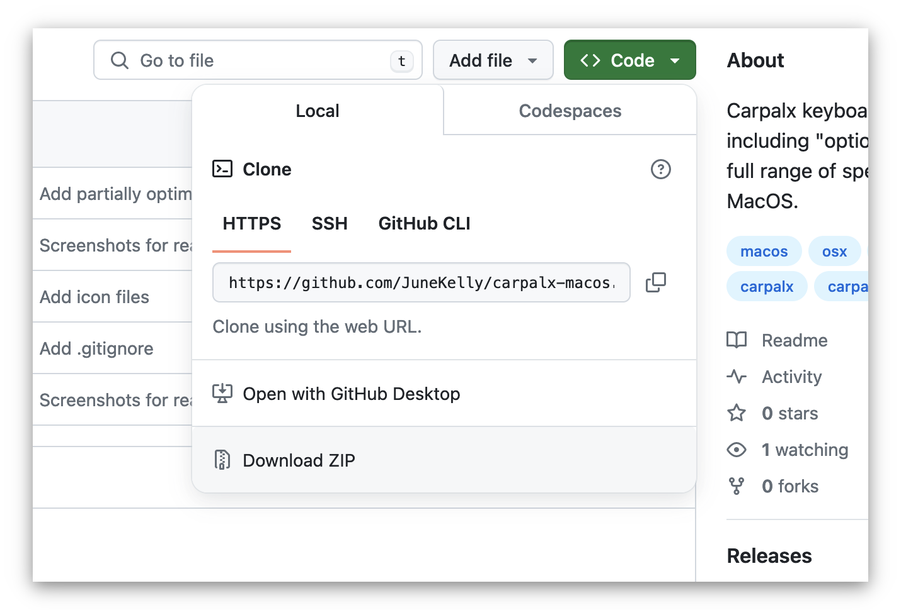
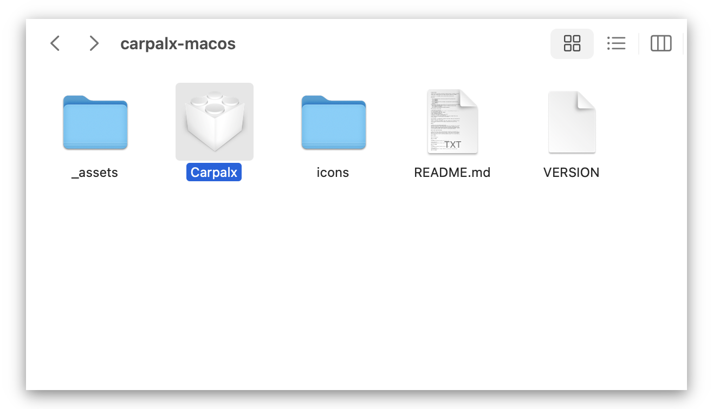
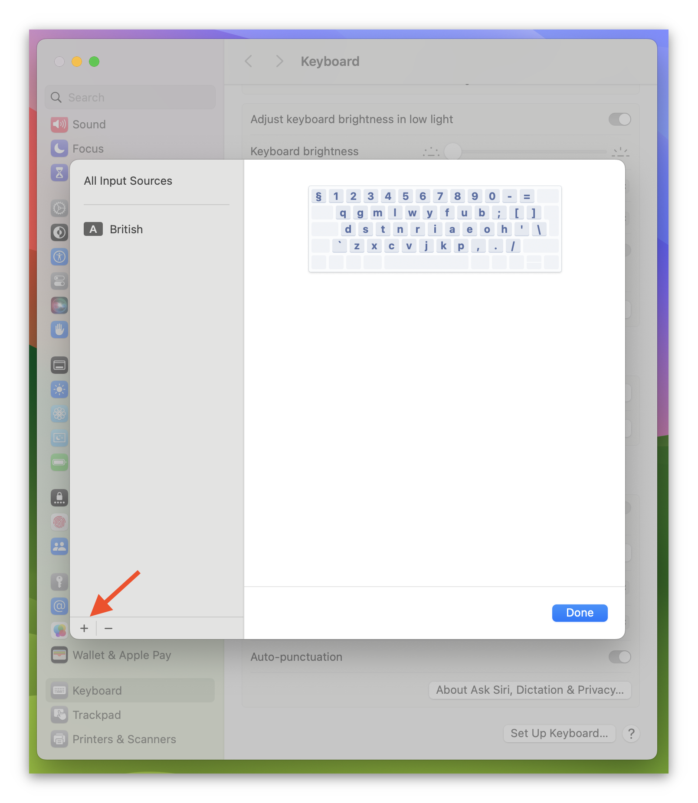
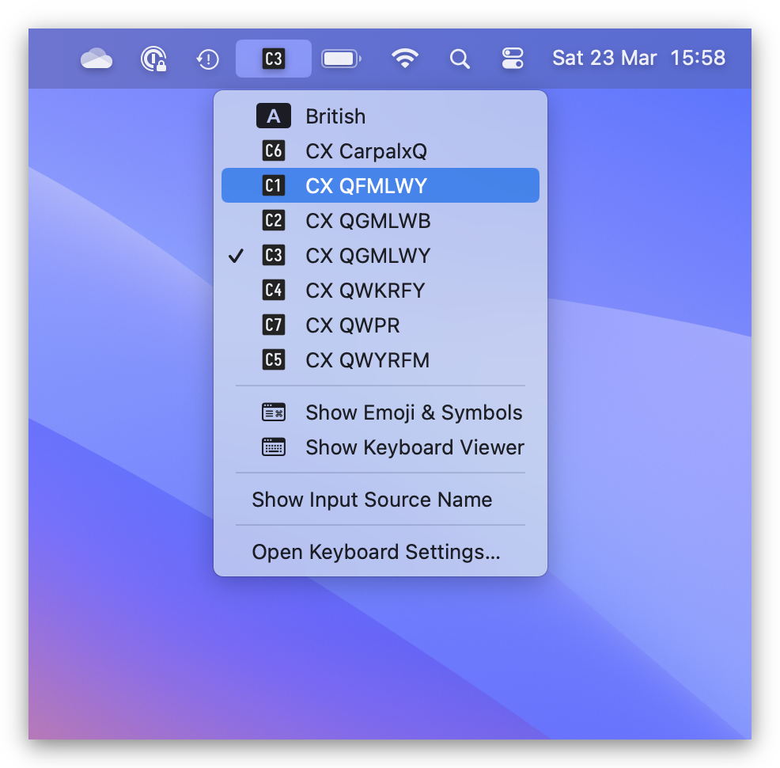

# Carpalx MacOS

[Carpalx](https://mk.bcgsc.ca/carpalx/) keyboard layouts for MacOS, including
"option keys" supporting the full range of special characters on MacOS.

## Layouts

- [Fully Optimised](https://mk.bcgsc.ca/carpalx/?full_optimization)
  - (C1) **QFMLWY**
  - (C2) **QGMLWB**
  - (C3) **QGMLWY**
- [Partially Optimised](https://mk.bcgsc.ca/carpalx/?partial_optimization)
  - (C4) **QWKRFY**
  - (C5) **QWYRFM**
- [Community
Layouts](https://mk.bcgsc.ca/carpalx/?partial_optimization#carpalxq_user_contribution)
  - (C6) **CarpalxQ** (by [Jay
  Walker](http://jumpedthesynapse.blogspot.com/2007/07/carpalxq.html))
  - (C7) **QGPR** (by [Jameson
  Quinn](https://sourceforge.net/p/qwpr/wiki/Home/))

## Installation Instructions

1. Download this repository, by clicking the green "Code" button above and
   choosing either a `git`-based option, or choosing the zip file.

2. Copy the `Carpalx.bundle` file to either `~/Library/Keyboard Layouts/`, or
to `/Library/Keyboard Layouts/`

3. (You may need to restart your computer at this point)

4. Open the System Settings app

5. Open "Keyboard" settings

6. Under the "Text Input" heading, click "Edit"

7. Click the "+" button in the lower-left

8. (At this point, the Carpalx bundle should have been loaded) Select the
   Carpalx layout you'd like to add (All layouts in this bundle start with
"CX"), and click "Add"

9. Click "Done"

10. In the menu bar, you should see the input source menu, where you can select the
keyboard layout you'd like to use.

(Caveat: I personally use QGMLWY, so the other layouts are a blind-spot for me.
If you have any problems with the layouts, please open an issue on this
repository!)

## Why?

I've been using the [Carpalx layouts from
deekan](https://github.com/deekayen/carpalx_mac) for a long time, but I noticed
that those layouts don't have "option keys", the special characters that are
available on MacOS keyboard layouts by holding the Option key. Because of this,
it's not possible to type special characters or access the "dead keys" required
to add accented characters like you can on a normal keyboard layout.

## How These Layouts Were Made

I made these layouts with the [Ukelele](https://software.sil.org/ukelele/)
keyboard editor app, starting from the default Colemak layout and then swapping
keys until I had the desired layouts. By doing it this way, all the "special
stuff" was preserved, and the resulting keyboard layouts fit in nicely with the
rest of MacOS.

## The Layouts

### Fully Optimised

#### (C1) QFMLWY

Default:

Holding "Option":

#### (C2) QGMLWB

Default:

Holding "Option":

#### (C3) QGMLWY

Default:

Holding "Option":

### Partially Optimised

#### (C4) QWKRFY

Default:

Holding "Option":

#### (C5) QWYRFM

Default:

Holding "Option":

### Community-Contributed Layouts

#### (C6) CarpalxQ

Default:

Holding "Option":

#### (C7) QWPR

Default:

Holding "Option":

## License

This work is released under the MIT license:

Copyright (c) 2024 June Kelly.

Permission is hereby granted, free of charge, to any person obtaining a copy
of this software and associated documentation files (the "Software"), to deal
in the Software without restriction, including without limitation the rights
to use, copy, modify, merge, publish, distribute, sublicense, and/or sell
copies of the Software, and to permit persons to whom the Software is
furnished to do so, subject to the following conditions:

The above copyright notice and this permission notice shall be included in all
copies or substantial portions of the Software.

THE SOFTWARE IS PROVIDED "AS IS", WITHOUT WARRANTY OF ANY KIND, EXPRESS OR
IMPLIED, INCLUDING BUT NOT LIMITED TO THE WARRANTIES OF MERCHANTABILITY,
FITNESS FOR A PARTICULAR PURPOSE AND NONINFRINGEMENT. IN NO EVENT SHALL THE
AUTHORS OR COPYRIGHT HOLDERS BE LIABLE FOR ANY CLAIM, DAMAGES OR OTHER
LIABILITY, WHETHER IN AN ACTION OF CONTRACT, TORT OR OTHERWISE, ARISING FROM,
OUT OF OR IN CONNECTION WITH THE SOFTWARE OR THE USE OR OTHER DEALINGS IN THE
SOFTWARE.
